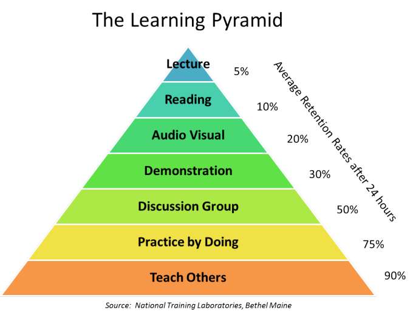

# Mission On Call of Duty: ARTS

This project is inspired by a top famous chinese developer who wrote a series of acticles in GeekBang.com. In his recent blog, he re-introduced his opinion on how to become a effective learner within at least 100 days in one of his acticle: *["Mission On Call of Duty: ARTS"《ARTS 打卡召集令》](https://time.geekbang.org/column/article/85839)*.

  

This project is just a tracking tool for personal practice on four main area per week:

- Algorithm: Practice at least one type of algorithm from *[Leetcode](https://leetcode.com/)*

- Review: Read and review at least one technial article from top tier websites like Mediums or top geek blogs

- Tips: Write down some tips or summarize any ideas from Study, Projects, Works or Articles

- Share: Write at least one technical article to share what I have learned during this week  

## Timeline

---

***Week1: 2019 April***

- Algorithm: [Binary Tree related Algorithm](0-Algorithm/1st-w-alg.md)

- Review: [JavaScript essentials: why you should know how the engine works](1-Review/1st-w-review.md)

- Tips: [When to use Git rebase and when to use Git merge](2-Tips/1st-w-tips.md)

- Share: [Common Object operations in Javascript](3-Share/1st-w-share.md)

---

***Week2: 2019 April***

TODO

---
